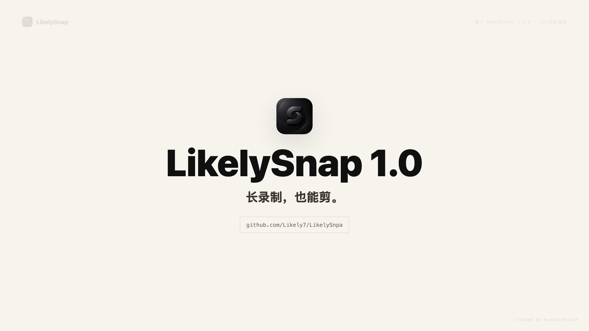

[English](./README.en.md) | 简体中文

# LikelySnap

面向长录制的屏幕录制和轻量剪辑工具。LikelySnap 基于 OpenScreen 1.5.0 深度改造，重点解决长时间录屏的保存、恢复、摄像头同步、鼠标 Zoom 和 MP4 导出问题。

## 功能特色

- 屏幕/窗口录制，支持麦克风、系统声音和摄像头。
- 录制过程中持续写入磁盘，不把长录制押在最后一秒保存。
- 每次录制保存为一个 `.likelysnap` 项目包，方便移动、重新打开和恢复。
- 保存鼠标轨迹，支持后期编辑鼠标效果、自动 Zoom 和跟随鼠标。
- 自动 Zoom 会根据讲解意图生成建议，避免普通单击也频繁放大。
- 支持剪辑、裁剪、变速、背景、注释、模糊、字幕、MP4/GIF 导出。
- MP4 导出走 FFmpeg 流式写文件路径，更适合长视频。
- 支持 macOS 和 Windows x64。

## 安装

已经打包好的安装包都在 GitHub Releases，不需要自己下载源码编译。

[前往 Releases 下载安装包](https://github.com/Likely7/LikelySnpa/releases/latest)

### macOS

1. 下载 macOS 的 `.dmg` 安装包。
2. 打开 `.dmg`，把 `LikelySnap.app` 拖到 `Applications` / `应用程序` 文件夹。
3. 第一次启动时，按提示授予录屏、系统音频、麦克风和摄像头权限。
4. 如果 macOS 要求重新打开软件，完全退出 LikelySnap 后再启动一次。

### Windows

1. 下载 Windows 的免安装压缩包。
2. 先完整解压到一个固定文件夹。
3. 运行解压后文件夹里的 `LikelySnap.exe`。

不要在压缩包里直接双击运行。录制和导出会用到同目录里的运行文件，直接在压缩包里运行可能会出问题。

## 适合什么场景

- 录制教程、课程、产品演示、软件操作讲解。
- 一次录制几十分钟甚至更久。
- 同时录屏幕、摄像头、麦克风和系统声音。
- 录完后继续调整鼠标效果、Zoom 片段、字幕和剪辑。
- 导出可发布的 MP4，或导出短片段 GIF。

## 如何使用

1. 打开 LikelySnap。
2. 在设置里选择录制目录、画质、帧率、麦克风、系统声音、摄像头等选项。
3. 选择屏幕、窗口或区域开始录制。
4. 停止录制后，LikelySnap 会打开生成的 `.likelysnap` 项目包。
5. 在编辑器里剪辑、调整 Zoom、鼠标、摄像头布局和字幕。
6. 导出 MP4 或 GIF。

## 和原版 OpenScreen 的区别

LikelySnap 不是简单换皮。它基于 OpenScreen 1.5.0 改造，但主要方向已经从“短录制小工具”转向“长录制项目化工作流”。

主要变化：

- 从停止后集中保存，改成录制中持续写文件。
- 从单个普通视频文件，改成 `.likelysnap` 项目包。
- 从 renderer webcam WebM 为主，改成 native webcam sidecar 为主。
- 从最终内存 Blob 导出 MP4，改成 FFmpeg 流式写入临时文件再落成最终 MP4。
- 自动 Zoom 从简单鼠标停留，改成更关注讲解意图的判断模型。
- 增加独立设置窗口，录制目录、项目目录、缓存目录、画质、帧率、码率和默认录制开关都可以配置。

## 自动 Zoom

自动 Zoom 的目标不是“鼠标去哪就放大哪”，而是尽量判断用户是否真的在讲解某个位置。

它会优先识别：

- 鼠标在一个小区域停留讲解。
- 小范围移动但没有离开讲解区域。
- 长时间停留在同一区域。
- 按住鼠标、拖动、框选、划线。
- 重复点击或双击。
- 很近的多个 Zoom 建议会合并，避免画面来回跳。

它会尽量避开：

- 单独点一下就离开。
- 点击后鼠标马上离开很远。
- 已经有手动 Zoom 的位置。

每个 Zoom 片段都可以单独设置为：不跟随、智能跟随鼠标、始终跟随鼠标。

## 长录制说明

LikelySnap 的方向是让长录制更可靠，但长录制本身仍然是重活。

当前版本已经重做了录制保存、项目包、摄像头 sidecar 和 MP4 导出链路。编辑器打开长项目也做过缓存和分阶段加载优化，但还不是完整的 Premiere Pro、DaVinci Resolve、Final Cut Pro 那类 NLE 架构。

如果你录制 30 分钟、1 小时甚至更久，第一次打开项目时仍然可能需要等待。软件需要准备视频信息、波形、鼠标预览和自动 Zoom 建议。区别在于：目标是让录制文件已经安全落盘，并且项目可以继续打开、编辑和导出。

当前边界：

- 很长的视频第一次打开仍然可能明显等待。
- GIF 导出不适合超长视频，长视频请优先导出 MP4。
- Windows 端不同显卡、驱动和系统环境差异较大，还需要更多真机验证。
- 多小时级项目比原版更稳，但仍然需要继续做极限测试。

## 这个项目是怎么来的

最初原因很简单：我用原版 OpenScreen 认真录了差不多 40 分钟，点停止后文件消失了。

不是损坏，不是打不开，而是真的找不到。40 分钟录制没有留下可恢复文件，这件事直接把 LikelySnap 这个改造方向推了出来。

所以 LikelySnap 的核心不是换名字、换颜色或换 logo，而是先把长录制最容易翻车的底层链路重做：录制要持续落盘，项目要能恢复，摄像头和声音要对齐，导出不能把整段视频憋在内存里。

编辑器后续还会继续往更完整的 NLE 架构推进，包括素材索引、代理文件、后台任务、分层缓存和更快的长项目打开。

## 开发

安装依赖：

```bash
npm install
```

启动开发：

```bash
npm run dev
```

类型检查：

```bash
npx tsc --noEmit
```

## License

MIT License. See [LICENSE](./LICENSE).
